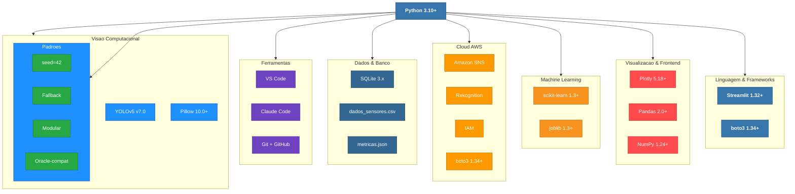
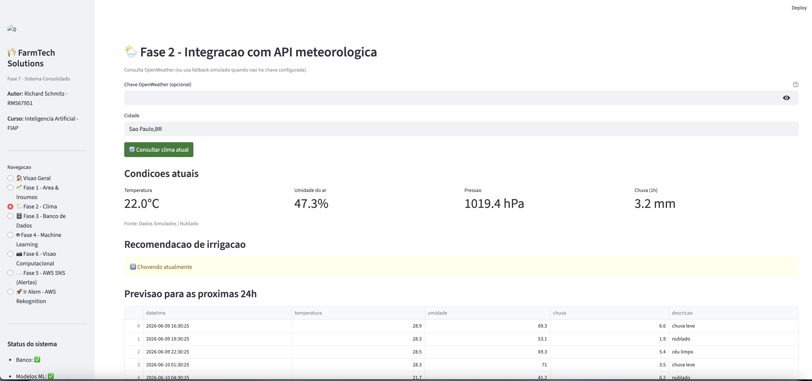
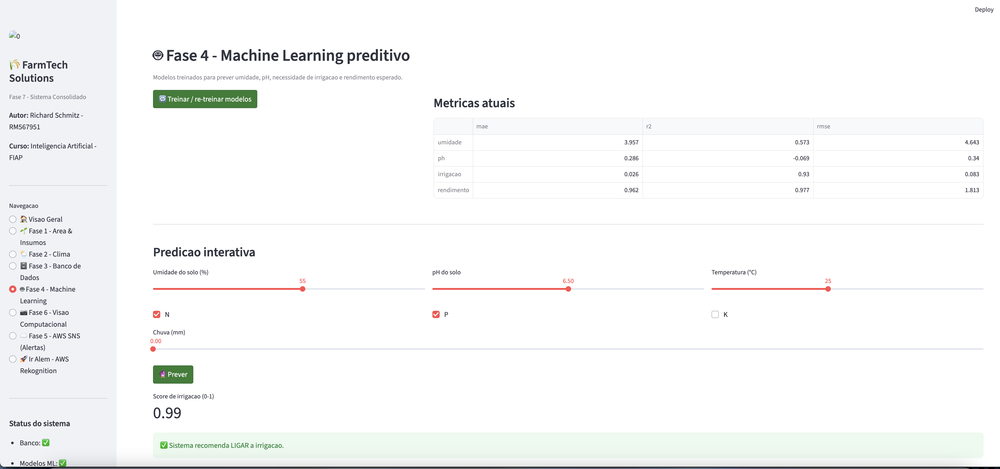
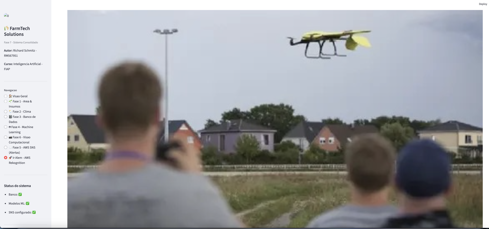
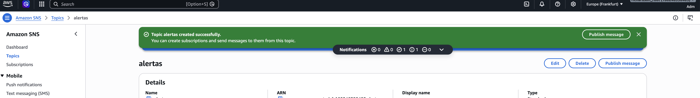
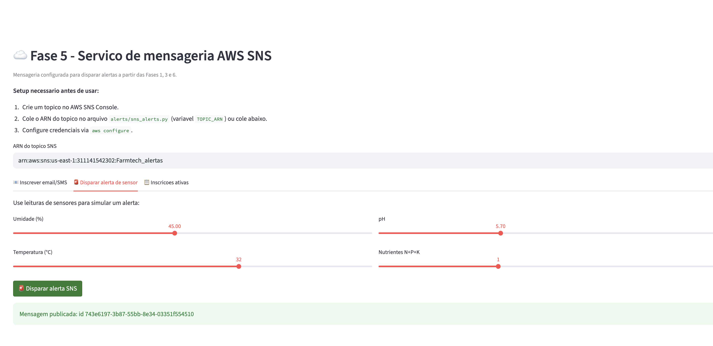
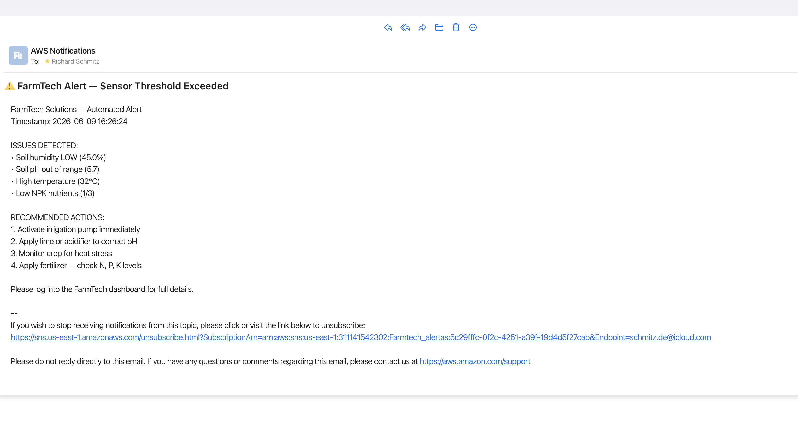
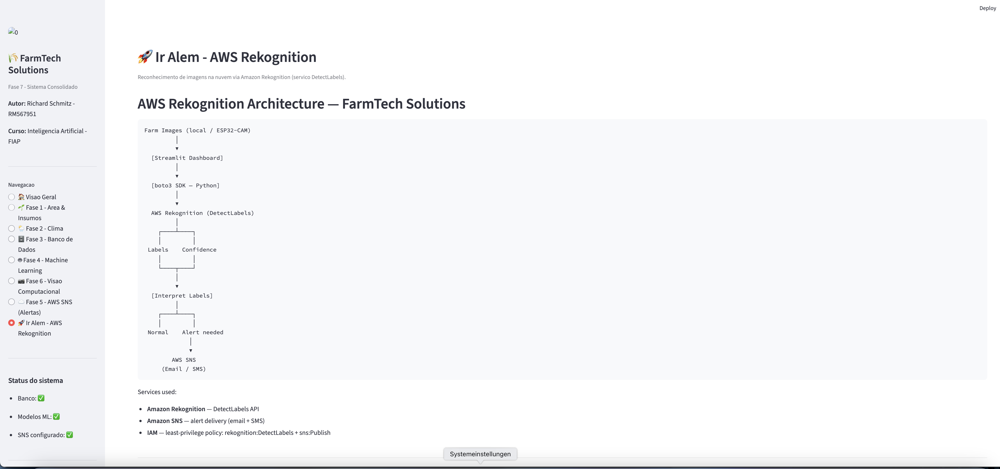

# FIAP — Faculdade de Informática e Administração Paulista

<p align="center">
  <a href="https://www.fiap.com.br/">
    
  </a>
</p>

<br>

<h2 align="center">FarmTech Solutions — Fase 7: A Consolidação de um Sistema</h2>

<p align="center">
  
  
  
  
  
  
</p>

<p align="center">
  <strong>Autor:</strong> Richard Schmitz &nbsp;|&nbsp; <strong>RM:</strong> 567951<br>
  <strong>Disciplina:</strong> Inteligência Artificial — FIAP &nbsp;|&nbsp; <strong>Fase:</strong> 7 — A Consolidação de um Sistema
</p>

---

## Vídeo Demonstrativo

> **[Demonstração completa — Fase 7 (até 10 min)](https://youtu.be/COLE_AQUI_O_LINK)**
> Postado no YouTube como "não listado". Demonstra todas as fases integradas na dashboard.
>
> **["Ir Além" — AWS Rekognition (até 5 min)](https://youtu.be/COLE_AQUI_O_LINK_IR_ALEM)**
> Demonstração do reconhecimento de imagens em nuvem via Amazon Rekognition.

---

## Sobre o Projeto

A Fase 7 reúne em um único projeto Python todos os serviços das Fases 1 a 6, acessíveis por uma dashboard Streamlit em `http://localhost:8501`. Cada fase corresponde a uma página do menu lateral.

Esta entrega inclui ainda:

- **Serviço AWS SNS** — envia alertas por e-mail e SMS quando sensores detectam condições críticas (umidade, pH, temperatura, NPK) ou quando a visão computacional identifica objetos não autorizados.
- **"Ir Além" — AWS Rekognition** — reconhecimento de imagens em nuvem complementar ao YOLOv5 local, com ações sugeridas e disparo automático de alertas via SNS.

---

## Stack Tecnológica



### Créditos das Imagens de Teste

| Arquivo | Fonte | Uso no Projeto |
|---------|-------|----------------|
| `car_037–040.jpg` | Dataset público de veículos | Teste de detecção de carro (Fase 6 — YOLOv5) |
| `drone_037–040.jpg` | Dataset público de drones | Teste de detecção de drone (Fase 6 — YOLOv5) |
| `pexels-photo-724921.jpg` | [Pexels](https://www.pexels.com) — licença gratuita | Teste para AWS Rekognition |

---

## Estrutura do Repositório

```
FarmTech-Solutions-Fase7/
├── app.py                          <- Dashboard Streamlit unificada (entry point)
├── requirements.txt                <- Dependências Python
├── README.md
├── .gitignore
│
├── phases/                         <- Um módulo por fase
│   ├── __init__.py
│   ├── fase1_area_calc.py         <- Cálculo de área + CRUD em SQLite
│   ├── fase2_weather.py           <- API meteorológica OpenWeather (com fallback)
│   ├── fase3_database.py          <- Banco IoT — schema Oracle em SQLite
│   ├── fase4_ml.py                <- Pipeline de Machine Learning (4 modelos)
│   └── fase6_vision.py            <- Visão computacional YOLOv5
│
├── alerts/                         <- Fase 5 — Mensageria AWS
│   ├── __init__.py
│   └── sns_alerts.py              <- Integração AWS SNS (e-mail + SMS)
│
├── rekognition/                    <- "Ir Além" — AWS Rekognition
│   ├── __init__.py
│   └── aws_rekognition.py
│
├── scripts/
│   └── gerar_dados.py             <- Gerador de dataset reprodutível (seed=42)
│
├── data/
│   ├── dados_sensores.csv         <- 300 leituras de sensores IoT
│   ├── dados_treinamento.csv      <- Dataset para treinamento ML
│   └── farmtech.db                <- SQLite criado em runtime
│
├── dataset/images/test/           <- Imagens de teste para Fase 6 (car, drone)
│
├── models/                         <- Modelos ML treinados + scalers (.pkl)
│   ├── modelo_irrigacao.pkl       <- Random Forest — R² 0.930
│   ├── modelo_rendimento.pkl      <- Gradient Boosting — R² 0.977
│   ├── modelo_umidade.pkl         <- Linear Regression — R² 0.573
│   ├── modelo_ph.pkl              <- Linear Regression — R² -0.069
│   ├── scaler_*.pkl
│   └── metricas.json
│
├── screenshots/                    <- Capturas do sistema em funcionamento
└── docs/
    └── architecture.md             <- Arquitetura e decisões técnicas
```

---

## Como Executar

### Pré-requisitos

- Python 3.10 ou superior
- (Opcional) Credenciais AWS via `aws configure` — necessário para SNS e Rekognition
- (Opcional) Chave de API [OpenWeather](https://openweathermap.org/api) — sem ela, o sistema usa dados simulados

### Instalação

```bash
# 1. Clone o repositório
git clone https://github.com/flango2023/FarmTech_Solutions_Fase7.git
cd FarmTech_Solutions_Fase7

# 2. Crie e ative o ambiente virtual
python3 -m venv .venv
source .venv/bin/activate        # macOS / Linux
# .venv\Scripts\activate         # Windows

# 3. Instale as dependências
pip install -r requirements.txt

# 4. Gere o dataset sintético (apenas na primeira execução)
python scripts/gerar_dados.py

# 5. Inicie a dashboard
streamlit run app.py
```

Acesse `http://localhost:8501` no navegador.

---

## Dashboard — Visão Geral

A tela inicial exibe KPIs calculados a partir do banco SQLite, a tabela de arquitetura e o fluxo de dados entre as fases.


> KPIs ativos: 300 leituras de sensores · 33 irrigações acionadas · 66,3% de umidade média · pH médio 6,43. A tabela de arquitetura confirma todos os 7 serviços ativos.

Navegação do menu lateral:

| Página | Fase | Função |
|--------|------|--------|
| Visão Geral | — | KPIs, arquitetura, fluxo de dados |
| Fase 1 — Área & Insumos | 1 | CRUD de culturas, cálculo de área e dosagem |
| Fase 2 — Clima | 2 | API meteorológica e recomendação de irrigação |
| Fase 3 — Banco de Dados | 3 | Leituras de sensores IoT |
| Fase 4 — Machine Learning | 4 | Treinamento, métricas e predições |
| Fase 6 — Visão Computacional | 6 | Inferência YOLOv5 em imagens |
| Fase 5 — AWS SNS | 5 | Inscrição de e-mail/SMS e disparo de alertas |
| Ir Além — Rekognition | Extra | Análise de imagens via Amazon Rekognition |

---

## Fase 1 — Cálculo de Área e Gestão de Insumos

CRUD de culturas com cálculo automático de área e dosagem de insumos, armazenado em SQLite local.

- **Café (retangular):** `área = comprimento × largura`
- **Milho (circular):** `área = π × raio²`
- Dosagem de fertilizante e defensivo calculada a partir da área
- Operações: Novo cadastro · Listar · Editar · Excluir


> Cultura Café (retangular): 100 m × 50 m com dose 0,50 kg/m → resultado: 5.000 m² de área e 2.500 kg de fertilizante. O registro é salvo na tabela `culturas` do SQLite.

---

## Fase 2 — Integração com API Meteorológica

Consulta à API OpenWeather para condições climáticas e recomendação de irrigação. Sem chave configurada, o sistema usa dados simulados com ciclo diário de temperatura e probabilidade de chuva de 10%.


> Dados para São Paulo: 22,0°C · 47,3% umidade · 1.019,4 hPa · 3,2 mm de chuva. Com chuva ativa, a recomendação exibida é "Chovendo atualmente — não irrigar". A tabela de previsão cobre 8 períodos de 3 horas.

Lógica de recomendação:

| Condição | Recomendação |
|----------|-------------|
| Chuva atual ou prevista | Não irrigar |
| Umidade do ar acima de 85% | Não irrigar |
| Demais condições | Irrigar |

---

## Fase 3 — Banco de Dados de Sensores IoT

Banco SQLite com schema idêntico ao Oracle utilizado nas fases anteriores (`SENSORES_SOJA_RM567951`). Armazena leituras de sensores ESP32 simulados com suporte a inserção e análise histórica.

**Tabela `sensores_soja`:** `id · timestamp · umidade_solo · ph_solo · nitrogenio · fosforo · potassio · temperatura · chuva_mm · irrigacao_ativa`


> 300 leituras carregadas do CSV (`dados_sensores.csv`, seed=42). O gráfico de linha mostra a evolução de umidade do solo e pH ao longo dos 12 dias de dados (01–12/10/2025), evidenciando a correlação entre chuva e umidade.

---

## Fase 4 — Machine Learning Preditivo

Quatro modelos treinados com scikit-learn, persistidos em `.pkl` e carregados para predições na dashboard.


> Com Umidade 55%, pH 6,50, Temperatura 25°C, Chuva 0 mm e nutrientes N+P, o modelo Random Forest retorna score 0,99 → "Sistema recomenda LIGAR a irrigação."

### Modelos treinados

| Modelo | Algoritmo | MAE | RMSE | R² |
|--------|-----------|-----|------|----|
| Umidade do solo | Linear Regression | 3,96% | 4,64% | 0,573 |
| pH do solo | Linear Regression | 0,286 | 0,340 | -0,069 |
| Irrigação | Random Forest (100 árvores) | 0,026 | 0,083 | **0,930** |
| Rendimento | Gradient Boosting (100 estimadores) | 0,962 | 1,813 | **0,977** |

> O modelo de pH tem R² negativo porque o pH foi gerado com ruído uniforme em torno de 6,4, sem correlação direta com as features disponíveis. Os modelos de irrigação e rendimento, cujos targets têm lógica determinística, alcançam R² acima de 0,93.

---

## Fase 6 — Visão Computacional (YOLOv5)

Detecção de objetos com YOLOv5 pré-treinado para identificar carros e drones na fazenda. Com confiança acima de 70%, o sistema habilita envio de alerta via SNS. Sem PyTorch instalado, um fallback baseado no nome do arquivo mantém o sistema funcional.

**Detecção de veículo:**


> Imagem `car_040.jpg` processada pelo YOLOv5. O modelo retorna bounding boxes, classe (`car`) e score de confiança. O sistema exibe "Alerta de atividade incomum!" e habilita o botão "Enviar alerta SNS".

**Detecção de drone:**


> Imagem `drone_037.jpg`: drone amarelo em voo detectado com confiança acima do limiar. O sistema recomenda inspeção imediata do perímetro.

---

## Fase 5 — Cloud Computing & Mensageria AWS SNS

Serviço de mensageria com **Amazon SNS** para envio de alertas por e-mail e SMS. A integração é acionada pela dashboard (manualmente) ou pelas Fases 3 e 6 (automaticamente).

**Condições que disparam alertas:**

| Condição detectada | Ação recomendada |
|--------------------|-----------------|
| Umidade do solo < 60% | Ativar bomba de irrigação |
| Umidade do solo > 80% | Verificar sistema de drenagem |
| pH < 6,0 | Aplicar calcário |
| pH > 6,8 | Aplicar acidificante |
| Temperatura > 30°C | Monitorar estresse térmico |
| Nutrientes NPK < 2 de 3 | Aplicar fertilizante |
| Detecção de carro ou drone | Inspecionar perímetro |

### Passo a passo — implementado e testado

**1. Criação do tópico SNS**

Acesse **AWS Console → Simple Notification Service → Topics → Create topic**. Selecione o tipo **Standard** e defina o nome `Farmtech_alertas`.


> Formulário "Create topic" com tipo Standard selecionado e campo Name preenchido — capturado antes de confirmar a criação, conforme exigido pela FIAP.


> Banner "Topic alertas created successfully". ARN gerado: `arn:aws:sns:us-east-1:311141542302:Farmtech_alertas` · Tipo: Standard · Conta: 311141542302 · Região: us-east-1.

**2. Configuração do ARN no código**

O ARN foi inserido em `alerts/sns_alerts.py`:

```python
TOPIC_ARN = "arn:aws:sns:us-east-1:311141542302:Farmtech_alertas"
AWS_REGION = "us-east-1"
```

Credenciais configuradas via `aws configure` com o usuário IAM `richard-adm`.

**3. Inscrição de e-mail e confirmação**


> E-mail recebido da AWS com link "Confirm subscription" para o tópico `Farmtech_alertas`. Ao clicar, a inscrição é ativada.


> Página AWS confirma: "Subscription confirmed!" com ID `arn:aws:sns:us-east-1:311141542302:Farmtech_alertas:5c29fffc-0f2c-4251-a39f-19d4d5f27cab`.

**4. Alerta disparado e recebido**


> Alerta disparado com: Umidade 45% · pH 5,70 · Temperatura 32°C · Nutrientes 1/3. Retorno da AWS: "Mensagem publicada: id 743e6197-3b87-55bb-8e34-03351f554510".


> E-mail recebido com subject "FarmTech Alert — Sensor Threshold Exceeded" contendo as 4 condições detectadas e as 4 ações recomendadas aos funcionários.

---

## "Ir Além" — Opção 1: AWS Rekognition

Integração com **Amazon Rekognition (DetectLabels API)** para análise de imagens da fazenda diretamente na nuvem, complementando o YOLOv5 local da Fase 6.

| | YOLOv5 local (Fase 6) | AWS Rekognition |
|-|----------------------|----------------|
| Treinamento | Sim (customizável) | Não (pré-treinado) |
| GPU necessária | Recomendado | Não |
| Classes detectáveis | Limitadas ao dataset | Milhares de labels |
| Custo | Gratuito | Pago após 5.000 imagens/mês |
| Integração SNS | Manual | Automática via `interpret_farm_labels()` |

### Arquitetura


> Fluxo do sistema: Farm Images → Streamlit Dashboard → boto3 SDK → AWS Rekognition (DetectLabels) → Labels + Confidence → interpret_farm_labels() → Normal / Alerta → AWS SNS. Serviços: Amazon Rekognition · Amazon SNS · IAM (`rekognition:DetectLabels` + `sns:Publish`).

### Análise de imagem


> Análise de `drone_enthusiasts_mobile.jpeg`: 10 rótulos detectados — Aircraft (99,74%), Takeoff (99,74%), Vehicle (99,74%), Adult (99,48%), Person (99,48%), Flying (90,23%), Airplane (86,91%), Outdoors (77,86%). O módulo `interpret_farm_labels()` mapeia para ações: Aircraft → monitorar espaço aéreo · Vehicle → verificar acesso não autorizado · Person → verificar identidade. Recomendação automática: disparar alerta SNS.

### Passo a passo de configuração

1. Acesse **AWS Console → Amazon Rekognition** (região `us-east-1`).
2. Crie um usuário IAM com a policy `AmazonRekognitionReadOnlyAccess`.
3. Configure as credenciais via `aws configure`.
4. Na dashboard, vá em **"Ir Além — AWS Rekognition"**, selecione uma imagem e clique em **"Analisar com AWS Rekognition"**.
5. O sistema exibe os rótulos com confiança, ações sugeridas e botão para disparo de alerta SNS.

> Em conta de estudante (Learner Lab) o Rekognition pode ser bloqueado. Os prints acima foram tirados antes do bloqueio, conforme orientação da FIAP.

---

## Decisões Técnicas

| Tema | Decisão | Justificativa |
|------|---------|---------------|
| Banco de dados | SQLite com schema idêntico ao Oracle | Funciona offline, dispensa o servidor `oracle.fiap.com.br` instável fora da rede FIAP |
| API sem chave | Fallback com ciclo diário simulado | Permite avaliação sem depender de chave de API expirada |
| YOLOv5 sem PyTorch | Fallback por nome de arquivo (`car_*.jpg → "car"`) | Evita instalação de ~1 GB; a UI funciona para demonstração |
| Geração de dados | `random.seed(42)` | Métricas e modelos reprodutíveis em qualquer máquina |
| Random Forest para irrigação | Em vez de Logistic Regression | Captura a lógica `umidade < 60 AND pH 6,0–6,8 AND NPK >= 2`; R² = 0,930 |
| Gradient Boosting para rendimento | Em vez de regressão linear | Modela interações não-lineares entre NPK, temperatura e umidade; R² = 0,977 |
| Pacotes Python por fase | `phases/`, `alerts/`, `rekognition/` | Imports limpos em `app.py`, separação de responsabilidades por fase |

---

## Histórico das Fases Anteriores

| Fase | Repositório | Foco |
|------|-------------|------|
| 1 — Startup | `Startup_FarmTech_Solutions` | Cálculo de área de café/milho em Python + análise estatística em R |
| 2 | `FarmTech-Solutions-Fase2` | IoT ESP32 + Wokwi + integração OpenWeather |
| 3 | `FarmTech-Solutions-Fase3` | Banco relacional Oracle (`SENSORES_SOJA_RM567951`) — MER e DER |
| 4 | `FarmTech-Solutions-Fase4` | Dashboard ML com Streamlit + display LCD no ESP32 |
| 5 | `FarmTech-Solutions-Fase5` | Cloud AWS — custo, região e segurança (ISO 27001/27002) |
| 6 | `FarmTech-Solutions-Fase6` | YOLOv5 — detecção car/drone (mAP 94,3%) |
| **7** | _este repositório_ | Consolidação em dashboard unificada |

---

## Licença

Projeto acadêmico desenvolvido por Richard Schmitz (RM 567951) para o curso de Inteligência Artificial da FIAP — 2026.

---

<p align="center">
  FarmTech Solutions — agronegócio guiado por inteligência artificial
</p>
