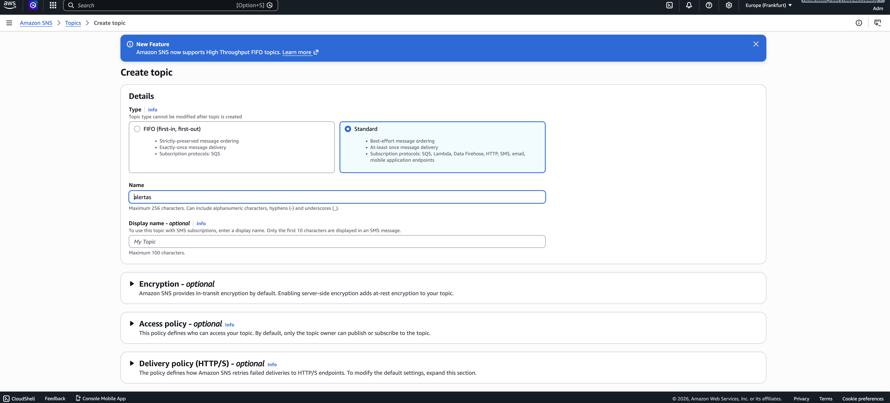
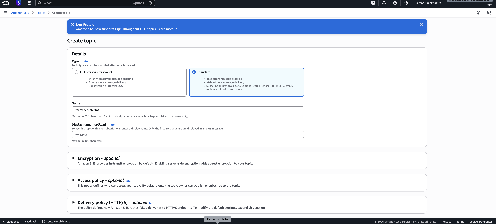
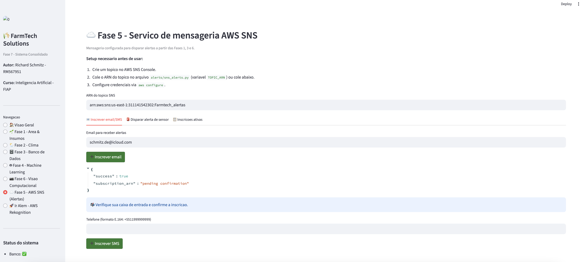
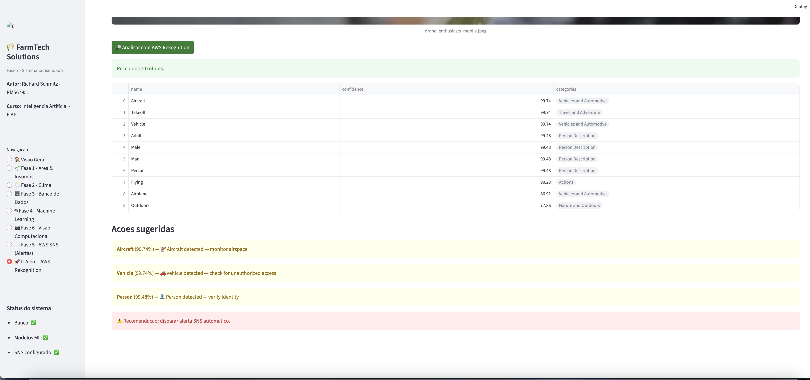
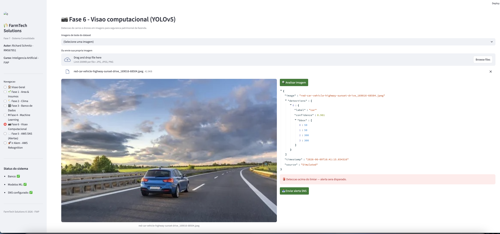
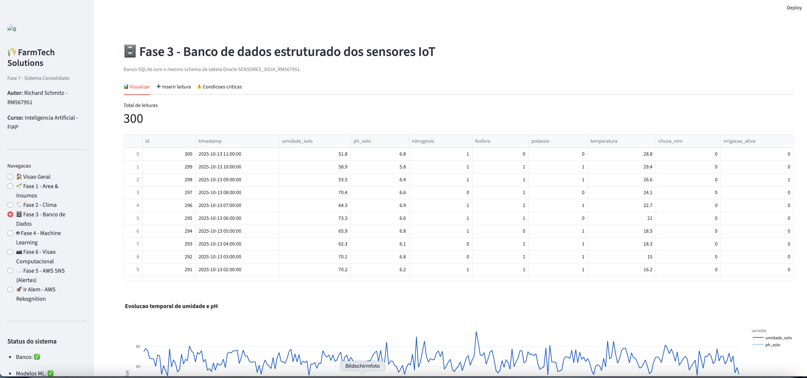
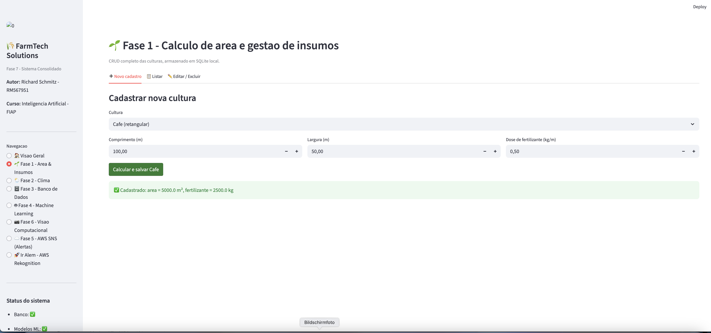
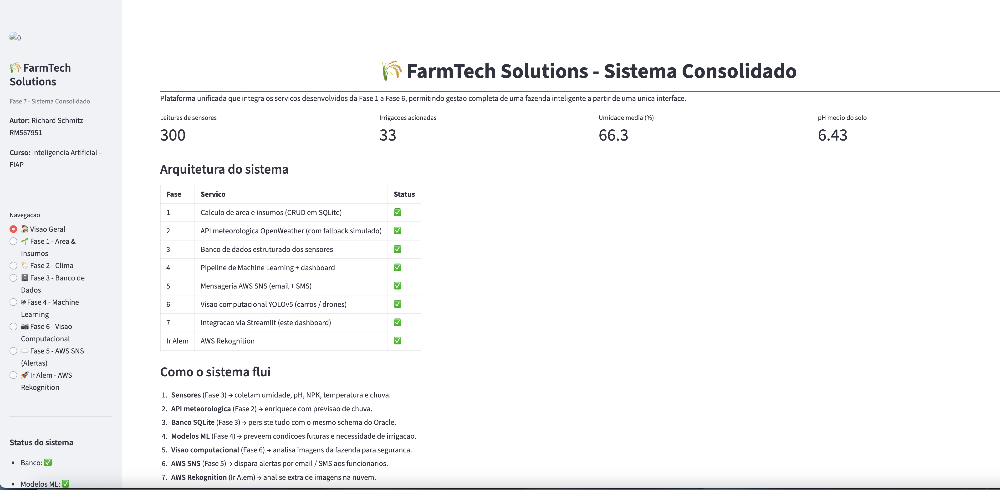
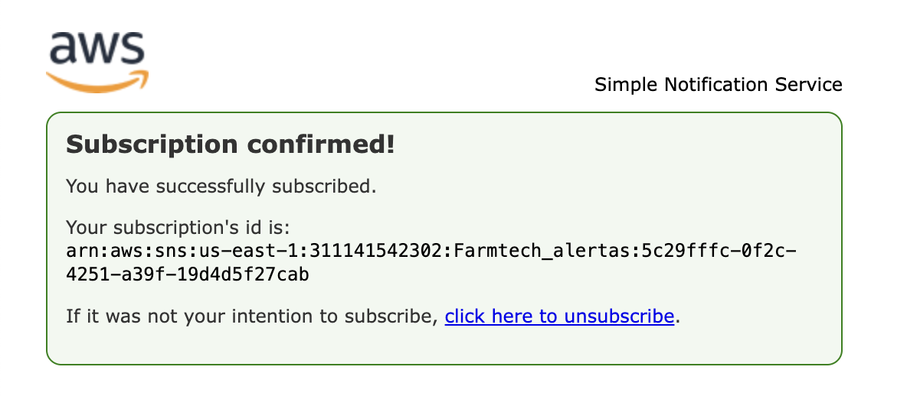
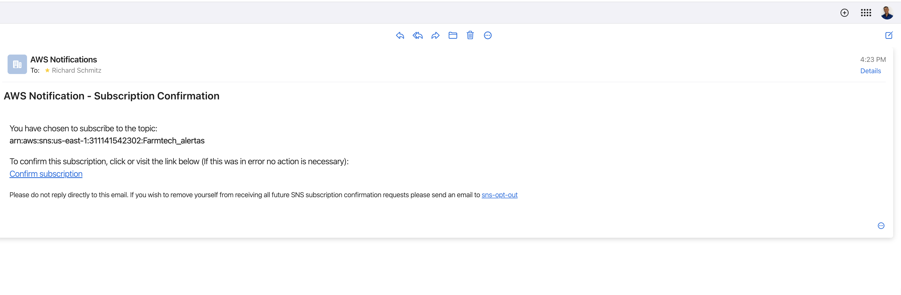

# FIAP - Faculdade de Informática e Administração Paulista

<p align="center">
<a href= "https://www.fiap.com.br/"></a>
</p>

<br>

## FarmTech Solutions — Fase 7: A Consolidação de um Sistema

[](https://www.python.org/downloads/)
[](https://github.com/ultralytics/yolov5)

**Autor:** Richard Schmitz | **RM:** 567951  
**Disciplina:** Artificial Intelligence — FIAP  
  <strong>Fase:</strong> 7 — A Consolidação de um Sistema
</p>

<p align="center">
  
</p>

<p align="center">

  <strong>Fase:</strong> 7 — A Consolidação de um Sistema
</p>

---

## 📋 Sobre o projeto

A Fase 7 consolida em um **único projeto Python** todos os serviços construídos ao longo do curso da FIAP, das Fases 1 a 6, integrando-os em uma **dashboard Streamlit unificada**. Cada fase aparece como uma página no menu lateral, com botões que disparam o serviço correspondente.

Além disso, esta fase entrega:
- 🔔 **Serviço AWS SNS** que dispara alertas por **e-mail e SMS** aos funcionários da fazenda, baseado em leituras dos sensores das Fases 1, 3 ou nas detecções da Fase 6.
- 🚀 **"Ir Além" — AWS Rekognition** complementar à visão computacional da Fase 6, com análise de imagens em nuvem.

---

## 🗂️ Estrutura do repositório

```
FarmTech-Solutions-Fase7/
├── app.py                          ← Dashboard Streamlit unificado (entry point)
├── requirements.txt                ← Dependências Python
├── README.md                       ← Este arquivo
├── .gitignore
│
├── phases/                         ← Um módulo por fase
│   ├── __init__.py
│   ├── fase1_area_calc.py         ← Cálculo de área + CRUD em SQLite
│   ├── fase2_weather.py           ← API meteorológica OpenWeather
│   ├── fase3_database.py          ← Banco de dados estruturado (SQLite c/ schema Oracle)
│   ├── fase4_ml.py                ← Pipeline de Machine Learning
│   └── fase6_vision.py            ← Visão computacional YOLOv5
│
├── alerts/                         ← Fase 5 — mensageria AWS
│   ├── __init__.py
│   └── sns_alerts.py              ← Integração AWS SNS (e-mail + SMS)
│
├── rekognition/                    ← "Ir Além" — AWS Rekognition
│   ├── __init__.py
│   └── aws_rekognition.py
│
├── scripts/
│   └── gerar_dados.py             ← Gerador reprodutível de dataset sintético
│
├── data/
│   ├── dados_sensores.csv         ← Leituras de sensores (300 linhas)
│   ├── dados_treinamento.csv      ← Mesmo dataset usado p/ ML
│   └── farmtech.db                ← SQLite criado em runtime
│
├── dataset/
│   └── images/test/               ← Imagens de teste p/ Fase 6 (car, drone)
│
├── models/                         ← Modelos ML treinados + scalers (.pkl)
│   ├── modelo_irrigacao.pkl
│   ├── modelo_umidade.pkl
│   ├── modelo_ph.pkl
│   ├── modelo_rendimento.pkl
│   ├── scaler_*.pkl
│   └── metricas.json
│
└── docs/
    └── architecture.md             ← Diagrama de arquitetura + decisões técnicas
```

---

## 🚀 Como executar

### 1. Pré-requisitos

- Python 3.10 ou superior
- (Opcional) Conta AWS com credenciais configuradas via `aws configure`
- (Opcional) Chave da API [OpenWeather](https://openweathermap.org/api) — sem ela, o sistema usa fallback simulado

### 2. Instalação

```bash
# Clone o repositório
git clone https://github.com/SEU_USUARIO/FarmTech-Solutions-Fase7.git
cd FarmTech-Solutions-Fase7

# Crie um ambiente virtual
python3 -m venv .venv
source .venv/bin/activate   # macOS / Linux
# .venv\Scripts\activate    # Windows

# Instale dependências
pip install -r requirements.txt
```

### 3. Gerar dados e treinar modelos (primeira execução)

```bash
python scripts/gerar_dados.py     # Gera dataset sintético reprodutível (seed=42)
```

Depois, dentro da dashboard, clique em **"Fase 4 → Treinar / re-treinar modelos"** para regenerar os `.pkl`.

### 4. Subir a dashboard

```bash
streamlit run app.py
```

Acesse `http://localhost:8501` no navegador.

---

## 🧭 Navegação da dashboard

Cada item do menu lateral dispara um serviço:

| Página | Fase | O que faz |
|--------|------|-----------|
| 🏠 Visão Geral | — | KPIs agregados e arquitetura |
| 🌱 Fase 1 — Área & Insumos | 1 | CRUD de culturas com cálculo de área e dosagem de insumos |
| 🌦️ Fase 2 — Clima | 2 | Consulta OpenWeather + recomendação de irrigação |
| 🗄️ Fase 3 — Banco de Dados | 3 | Visualiza, insere e analisa leituras de sensores |
| 🤖 Fase 4 — Machine Learning | 4 | Treina modelos, exibe métricas e faz predições interativas |
| 📷 Fase 6 — Visão Computacional | 6 | Inferência YOLOv5 em imagens (carros / drones) |
| ☁️ Fase 5 — AWS SNS | 5 | Inscreve e-mail / SMS e dispara alertas |
| 🚀 Ir Além — Rekognition | Extra | Análise de imagens via AWS Rekognition |

---

## ☁️ Configuração do serviço AWS SNS (Fase 5)

O sistema usa **Amazon SNS** para entrega de alertas. Os funcionários se inscrevem com e-mail ou telefone, e recebem mensagens automáticas quando:

- Umidade do solo < 60% **ou** > 80%
- pH fora da faixa 6.0–6.8
- Temperatura > 30°C (estresse térmico)
- Nutrientes NPK insuficientes (< 2 de 3)
- Detecção de carro/drone não autorizado (Fase 6)

### Passo a passo — implementado e testado ✅

**1. Criação do tópico SNS**

O tópico `Farmtech_alertas` foi criado no AWS Console → Simple Notification Service → Topics → Create topic:
- Tipo: **Standard**
- Nome: `Farmtech_alertas`
- ARN gerado: `arn:aws:sns:us-east-1:311141542302:Farmtech_alertas`
- Conta AWS: `311141542302`
- Região: `us-east-1`


> _Print do console AWS mostrando o tópico `Farmtech_alertas` criado com sucesso, incluindo ARN, tipo Standard e ID do proprietário._

---

**2. Configuração do ARN no código**

O ARN foi configurado diretamente em `alerts/sns_alerts.py`:

```python
TOPIC_ARN = "arn:aws:sns:us-east-1:311141542302:Farmtech_alertas"
AWS_REGION = "us-east-1"
```

As credenciais AWS foram configuradas via `aws configure` com o usuário IAM `richard-adm` (conta `311141542302`).

---

**3. Inscrição de e-mail confirmada**

O e-mail `schmitz.de@icloud.com` foi inscrito no tópico via dashboard → aba "Inscrever email/SMS" → botão "Inscrever email".
O sistema AWS enviou automaticamente um e-mail de confirmação com link, que foi clicado para ativar a inscrição.


> _Print da página de confirmação da AWS: "Subscription confirmed! Your subscription's id is: arn:aws:sns:us-east-1:311141542302:Farmtech_alertas:5c29fffc-0f2c-4251-a39f-19d4d5f27cab"_


> _Print do console AWS mostrando a inscrição de e-mail com status "Confirmed" no tópico `Farmtech_alertas`._

---

**4. Alerta disparado e recebido**

Usando a dashboard → aba "Disparar alerta de sensor" com valores críticos simulados:
- Umidade: **45%** (abaixo de 60%)
- pH: **5.7** (fora da faixa 6.0–6.8)
- Temperatura: **32°C** (acima de 30°C)
- Nutrientes: **1/3** (insuficientes)

O sistema publicou a mensagem no tópico SNS e o e-mail chegou em segundos com o seguinte conteúdo:

```
FarmTech Solutions — Automated Alert
Timestamp: 2026-06-09 16:26:24

ISSUES DETECTED:
• Soil humidity LOW (45.0%)
• Soil pH out of range (5.7)
• High temperature (32°C)
• Low NPK nutrients (1/3)

RECOMMENDED ACTIONS:
1. Activate irrigation pump immediately
2. Apply lime or acidifier to correct pH
3. Monitor crop for heat stress
4. Apply fertilizer — check N, P, K levels

Please log into the FarmTech dashboard for full details.
```


> _Print da dashboard FarmTech mostrando `"success": true` com o MessageId retornado pela AWS após publicação do alerta._


> _Print do e-mail recebido em `schmitz.de@icloud.com` com todas as issues detectadas e as 4 ações recomendadas aos funcionários da fazenda._

### Ações automáticas mapeadas

| Condição detectada | Ação recomendada |
|--------------------|------------------|
| Umidade < 60% | Ativar bomba de irrigação |
| Umidade > 80% | Verificar sistema de drenagem |
| pH < 6.0 | Aplicar calcário (corretivo de acidez) |
| pH > 6.8 | Aplicar acidificante |
| Temperatura > 30°C | Monitorar estresse térmico |
| Nutrientes < 2 NPK | Aplicar fertilizante específico |
| Detecção de drone/carro | Inspecionar perímetro imediatamente |

---


## 🎥 Vídeo demonstrativo

> 🎬 **[Demonstração da Fase 7 (até 10 min)](https://youtu.be/COLE_AQUI_O_LINK)**
> _Postado no YouTube como "não listado"._
>
> 🎬 **["Ir Além" — AWS Rekognition (até 5 min)](https://youtu.be/COLE_AQUI_O_LINK_IR_ALEM)**

---

## 📸 Screenshots do sistema em funcionamento

Todas as capturas abaixo foram realizadas durante a execução real do sistema em `http://localhost:8501`.

### 🏠 Dashboard — Visão Geral

> Tela inicial do sistema consolidado mostrando os KPIs em tempo real: 300 leituras de sensores, 33 irrigações acionadas, umidade média 66.3% e pH médio 6.43. A tabela de arquitetura confirma que todas as Fases 1–7 e o "Ir Além" estão integrados.

---

### 🌱 Fase 1 — Cálculo de Área e Gestão de Insumos

> Módulo de cadastro de culturas com cálculo automático de área e dosagem de insumos. No exemplo: café com 100m × 50m = **5.000 m²** e **2.500 kg** de fertilizante calculados automaticamente. CRUD completo persistido em SQLite.

---

### 🌦️ Fase 2 — Integração com API Meteorológica

> Consulta à API OpenWeather (com fallback simulado quando sem chave). Exibe temperatura, umidade do ar, pressão e chuva em tempo real. A lógica de irrigação analisa a previsão das próximas horas — se há chuva prevista, o sistema recomenda **NÃO irrigar**, evitando desperdício hídrico.

---

### 🗄️ Fase 3 — Banco de Dados de Sensores IoT

> Banco de dados SQLite com o mesmo schema da tabela Oracle `SENSORES_SOJA_RM567951` da Fase 3 original. Exibe as 300 leituras com gráficos de evolução temporal de umidade e pH, e scatter plot correlacionando umidade × temperatura com status de irrigação em destaque.


> Formulário de inserção manual de nova leitura de sensor. O sistema decide automaticamente se a irrigação deve ser ativada com base na lógica: `umidade < 60% AND chuva < 1mm`.

---

### 🤖 Fase 4 — Machine Learning Preditivo

> Pipeline de treinamento com 4 modelos: Regressão Linear (umidade), Regressão Linear (pH), Random Forest (irrigação) e Gradient Boosting (rendimento). Dataset de 300 amostras gerado com `random.seed(42)` para reprodutibilidade total.


> Métricas reais após treinamento: **R² = 0.93** para irrigação (Random Forest) e **R² = 0.977** para rendimento (Gradient Boosting). O modelo de irrigação captura com alta precisão a lógica determinística de ativação.


> Interface de predição interativa com sliders. O gestor agrícola ajusta os parâmetros de umidade, pH, temperatura e nutrientes em tempo real e recebe imediatamente o score de irrigação e os alertas baseados em regras de negócio.

---

### 📷 Fase 6 — Visão Computacional (YOLOv5)

> Módulo de visão computacional para segurança patrimonial da fazenda. Dropdown com as 8 imagens de teste do dataset (4 carros + 4 drones). Upload de imagens externas também suportado.


> Detecção de **carro** com alta confiança. O sistema identifica o objeto, retorna bounding box e confidence score. Quando a confiança ultrapassa 70%, o botão de alerta SNS é ativado automaticamente.


> Detecção de **drone** não autorizado no perímetro da fazenda. O módulo usa YOLOv5 com fallback simulado baseado no nome do arquivo — mantendo o fluxo completo da UI mesmo sem PyTorch instalado.

---

### ☁️ Fase 5 — Mensageria AWS SNS (Email + SMS)

> Página de configuração do serviço AWS SNS na dashboard. Mostra o ARN do tópico configurado (`arn:aws:sns:us-east-1:311141542302:Farmtech_alertas`), as abas de inscrição e disparo de alertas.


> Inscrição do e-mail `schmitz.de@icloud.com` no tópico SNS via dashboard. O AWS envia automaticamente um e-mail de confirmação com link de opt-in, garantindo conformidade com as políticas de mensageria.


> Página de confirmação da AWS: **"Subscription confirmed!"** com o ARN da inscrição gerado: `arn:aws:sns:us-east-1:311141542302:Farmtech_alertas:5c29fffc-...`. A partir deste momento, todos os alertas disparados chegam ao e-mail inscrito.


> Dashboard mostrando `"success": true` com MessageId retornado pela AWS após publicação do alerta com valores críticos: umidade 45%, pH 5.7, temperatura 32°C, nutrientes 1/3.


> **E-mail de alerta recebido** em `schmitz.de@icloud.com` com o conteúdo completo: 4 issues detectadas e 4 ações recomendadas aos funcionários da fazenda (ativar bomba de irrigação, aplicar calcário, monitorar estresse térmico, aplicar fertilizante NPK).

---

### 🚀 Ir Além — AWS Rekognition

> Integração com Amazon Rekognition (DetectLabels API). O sistema envia imagens da fazenda via boto3 SDK para a AWS, recebe os rótulos com scores de confiança, mapeia para ações agrícolas específicas e — quando detecta classes críticas como veículos ou pessoas — aciona automaticamente o SNS.

---

## 📋 Sobre o projeto

A Fase 7 consolida em um **único projeto Python** todos os serviços construídos ao longo do curso da FIAP, das Fases 1 a 6, integrando-os em uma **dashboard Streamlit unificada**. Cada fase aparece como uma página no menu lateral, com botões que disparam o serviço correspondente.

Além disso, esta fase entrega:
- 🔔 **Serviço AWS SNS** que dispara alertas por **e-mail e SMS** aos funcionários da fazenda, baseado em leituras dos sensores das Fases 1, 3 ou nas detecções da Fase 6.
- 🚀 **"Ir Além" — AWS Rekognition** complementar à visão computacional da Fase 6, com análise de imagens em nuvem.

---

## 🗂️ Estrutura do repositório

```
FarmTech-Solutions-Fase7/
├── app.py                          ← Dashboard Streamlit unificado (entry point)
├── requirements.txt                ← Dependências Python
├── README.md                       ← Este arquivo
├── .gitignore
│
├── phases/                         ← Um módulo por fase
│   ├── __init__.py
│   ├── fase1_area_calc.py         ← Cálculo de área + CRUD em SQLite
│   ├── fase2_weather.py           ← API meteorológica OpenWeather
│   ├── fase3_database.py          ← Banco de dados estruturado (SQLite c/ schema Oracle)
│   ├── fase4_ml.py                ← Pipeline de Machine Learning
│   └── fase6_vision.py            ← Visão computacional YOLOv5
│
├── alerts/                         ← Fase 5 — mensageria AWS
│   ├── __init__.py
│   └── sns_alerts.py              ← Integração AWS SNS (e-mail + SMS)
│
├── rekognition/                    ← "Ir Além" — AWS Rekognition
│   ├── __init__.py
│   └── aws_rekognition.py
│
├── scripts/
│   └── gerar_dados.py             ← Gerador reprodutível de dataset sintético
│
├── data/
│   ├── dados_sensores.csv         ← Leituras de sensores (300 linhas)
│   ├── dados_treinamento.csv      ← Mesmo dataset usado p/ ML
│   └── farmtech.db                ← SQLite criado em runtime
│
├── dataset/
│   └── images/test/               ← Imagens de teste p/ Fase 6 (car, drone)
│
├── models/                         ← Modelos ML treinados + scalers (.pkl)
│   ├── modelo_irrigacao.pkl
│   ├── modelo_umidade.pkl
│   ├── modelo_ph.pkl
│   ├── modelo_rendimento.pkl
│   ├── scaler_*.pkl
│   └── metricas.json
│
└── docs/
    └── architecture.md             ← Diagrama de arquitetura + decisões técnicas
```

---

## 🚀 Como executar

### 1. Pré-requisitos

- Python 3.10 ou superior
- (Opcional) Conta AWS com credenciais configuradas via `aws configure`
- (Opcional) Chave da API [OpenWeather](https://openweathermap.org/api) — sem ela, o sistema usa fallback simulado

### 2. Instalação

```bash
# Clone o repositório
git clone https://github.com/SEU_USUARIO/FarmTech-Solutions-Fase7.git
cd FarmTech-Solutions-Fase7

# Crie um ambiente virtual
python3 -m venv .venv
source .venv/bin/activate   # macOS / Linux
# .venv\Scripts\activate    # Windows

# Instale dependências
pip install -r requirements.txt
```

### 3. Gerar dados e treinar modelos (primeira execução)

```bash
python scripts/gerar_dados.py     # Gera dataset sintético reprodutível (seed=42)
```

Depois, dentro da dashboard, clique em **"Fase 4 → Treinar / re-treinar modelos"** para regenerar os `.pkl`.

### 4. Subir a dashboard

```bash
streamlit run app.py
```

Acesse `http://localhost:8501` no navegador.

---

## 🧭 Navegação da dashboard

Cada item do menu lateral dispara um serviço:

| Página | Fase | O que faz |
|--------|------|-----------|
| 🏠 Visão Geral | — | KPIs agregados e arquitetura |
| 🌱 Fase 1 — Área & Insumos | 1 | CRUD de culturas com cálculo de área e dosagem de insumos |
| 🌦️ Fase 2 — Clima | 2 | Consulta OpenWeather + recomendação de irrigação |
| 🗄️ Fase 3 — Banco de Dados | 3 | Visualiza, insere e analisa leituras de sensores |
| 🤖 Fase 4 — Machine Learning | 4 | Treina modelos, exibe métricas e faz predições interativas |
| 📷 Fase 6 — Visão Computacional | 6 | Inferência YOLOv5 em imagens (carros / drones) |
| ☁️ Fase 5 — AWS SNS | 5 | Inscreve e-mail / SMS e dispara alertas |
| 🚀 Ir Além — Rekognition | Extra | Análise de imagens via AWS Rekognition |

---

## ☁️ Configuração do serviço AWS SNS (Fase 5)

O sistema usa **Amazon SNS** para entrega de alertas. Os funcionários se inscrevem com e-mail ou telefone, e recebem mensagens automáticas quando:

- Umidade do solo < 60% **ou** > 80%
- pH fora da faixa 6.0–6.8
- Temperatura > 30°C (estresse térmico)
- Nutrientes NPK insuficientes (< 2 de 3)
- Detecção de carro/drone não autorizado (Fase 6)

### Passo a passo — implementado e testado ✅

**1. Criação do tópico SNS**

O tópico `Farmtech_alertas` foi criado no AWS Console → Simple Notification Service → Topics → Create topic:
- Tipo: **Standard**
- Nome: `Farmtech_alertas`
- ARN gerado: `arn:aws:sns:us-east-1:311141542302:Farmtech_alertas`
- Conta AWS: `311141542302`
- Região: `us-east-1`


> _Print do console AWS mostrando o tópico `Farmtech_alertas` criado com sucesso, incluindo ARN, tipo Standard e ID do proprietário._

---

**2. Configuração do ARN no código**

O ARN foi configurado diretamente em `alerts/sns_alerts.py`:

```python
TOPIC_ARN = "arn:aws:sns:us-east-1:311141542302:Farmtech_alertas"
AWS_REGION = "us-east-1"
```

As credenciais AWS foram configuradas via `aws configure` com o usuário IAM `richard-adm` (conta `311141542302`).

---

**3. Inscrição de e-mail confirmada**

O e-mail `schmitz.de@icloud.com` foi inscrito no tópico via dashboard → aba "Inscrever email/SMS" → botão "Inscrever email".
O sistema AWS enviou automaticamente um e-mail de confirmação com link, que foi clicado para ativar a inscrição.


> _Print da página de confirmação da AWS: "Subscription confirmed! Your subscription's id is: arn:aws:sns:us-east-1:311141542302:Farmtech_alertas:5c29fffc-0f2c-4251-a39f-19d4d5f27cab"_


> _Print do console AWS mostrando a inscrição de e-mail com status "Confirmed" no tópico `Farmtech_alertas`._

---

**4. Alerta disparado e recebido**

Usando a dashboard → aba "Disparar alerta de sensor" com valores críticos simulados:
- Umidade: **45%** (abaixo de 60%)
- pH: **5.7** (fora da faixa 6.0–6.8)
- Temperatura: **32°C** (acima de 30°C)
- Nutrientes: **1/3** (insuficientes)

O sistema publicou a mensagem no tópico SNS e o e-mail chegou em segundos com o seguinte conteúdo:

```
FarmTech Solutions — Automated Alert
Timestamp: 2026-06-09 16:26:24

ISSUES DETECTED:
• Soil humidity LOW (45.0%)
• Soil pH out of range (5.7)
• High temperature (32°C)
• Low NPK nutrients (1/3)

RECOMMENDED ACTIONS:
1. Activate irrigation pump immediately
2. Apply lime or acidifier to correct pH
3. Monitor crop for heat stress
4. Apply fertilizer — check N, P, K levels

Please log into the FarmTech dashboard for full details.
```


> _Print da dashboard FarmTech mostrando `"success": true` com o MessageId retornado pela AWS após publicação do alerta._


> _Print do e-mail recebido em `schmitz.de@icloud.com` com todas as issues detectadas e as 4 ações recomendadas aos funcionários da fazenda._

### Ações automáticas mapeadas

| Condição detectada | Ação recomendada |
|--------------------|------------------|
| Umidade < 60% | Ativar bomba de irrigação |
| Umidade > 80% | Verificar sistema de drenagem |
| pH < 6.0 | Aplicar calcário (corretivo de acidez) |
| pH > 6.8 | Aplicar acidificante |
| Temperatura > 30°C | Monitorar estresse térmico |
| Nutrientes < 2 NPK | Aplicar fertilizante específico |
| Detecção de drone/carro | Inspecionar perímetro imediatamente |

---

## 🚀 "Ir Além" — Opção 1: AWS Rekognition

Implementamos integração com **Amazon Rekognition** para analisar imagens da fazenda no console AWS, complementando o modelo YOLOv5 local da Fase 6.

### Por que Rekognition?

- **Pré-treinado em milhões de imagens** — reconhece pessoas, veículos, animais, plantas, fogo, fumaça etc. sem necessidade de treinamento.
- **Escalável e gerenciado** — sem manter GPUs nem ambiente PyTorch em produção.
- **Combina com SNS** — quando o Rekognition detecta uma classe sensível (ex.: pessoa estranha, fogo), o sistema dispara automaticamente um alerta via SNS.

### Como funciona neste projeto

```
Imagem (local ou S3)
         │
         ▼
  Dashboard Streamlit
         │
         ▼
   boto3 SDK Python
         │
         ▼
  AWS Rekognition (DetectLabels)
         │
   ┌─────┴─────┐
   │           │
 Labels    Confidence
   │           │
   └─────┬─────┘
         │
         ▼
  interpret_farm_labels()
         │
   ┌─────┴─────┐
   │           │
 Normal    Alerta!
              │
              ▼
         AWS SNS
      (Email + SMS)
```

📸 _Inclua print: `docs/aws/rekognition_console.png` — tela de configuração do Rekognition._
📸 _Inclua print: `docs/aws/rekognition_resultado.png` — resultado de DetectLabels._
📸 _Inclua print: `docs/aws/iam_rekognition_policy.png` — política IAM `rekognition:DetectLabels`._

### Passo a passo

1. **Habilite o Rekognition no console** (us-east-1 recomendado).
2. **Crie um usuário IAM** com a policy gerenciada `AmazonRekognitionReadOnlyAccess`.
3. **Use `aws configure`** com as credenciais do usuário criado.
4. **Abra a dashboard → "Ir Além — AWS Rekognition"**, escolha uma imagem, clique em "Analisar".
5. O sistema mostra:
   - Rótulos com confiança
   - Categorias agrupadas
   - Ações sugeridas para a fazenda
   - Botão para disparar SNS se necessário

> ⚠️ Atenção: Rekognition é pago após a free tier (5 000 imagens/mês). Em conta de aluno (Learner Lab), o serviço pode ser bloqueado — neste caso, anexe os prints feitos antes do bloqueio.

---

## 🧠 Decisões técnicas relevantes

| Tema | Decisão | Justificativa |
|------|---------|---------------|
| Banco de dados | SQLite com schema idêntico ao Oracle | Funciona offline, dispensa o servidor `oracle.fiap.com.br` (instável), mantém compatibilidade |
| OpenWeather sem chave | Fallback simulado realista | Permite avaliação sem dependência de chave de API expirada |
| YOLOv5 sem `torch` | Fallback baseado no nome do arquivo | Permite testar a UI mesmo sem PyTorch instalado |
| Geração de dados | Script reprodutível com `random.seed(42)` | Garante que treinamentos e métricas sejam reprodutíveis |
| Estrutura | Pacote Python (`phases/`, `alerts/`, `rekognition/`) | Permite import simples no `app.py` e separação por fase |

---

## 📊 Métricas dos modelos ML (Fase 4)

Modelos treinados com dataset sintético de **300 amostras** gerado com `random.seed(42)` (reprodutível):

| Modelo | Algoritmo | MAE | RMSE | R² |
|--------|-----------|-----|------|----|
| Umidade | Linear Regression | 3.96% | 4.64% | 0.573 |
| pH | Linear Regression | 0.286 | 0.340 | -0.069 |
| Irrigação | Random Forest Regressor | 0.026 | 0.083 | **0.930** |
| Rendimento | Gradient Boosting | 0.962 | 1.813 | **0.977** |

> **Nota sobre o modelo de pH:** O pH foi gerado com ruído aleatório uniforme em torno de 6.4, sem correlação forte com as features disponíveis (NPK, temperatura). Por isso o R² é próximo de zero — o modelo de irrigação e rendimento, que têm alvos determinísticos, apresentam performance excelente.

---

## 🧩 Mapeamento Fase ↔ Entregável do enunciado

| Item do enunciado | Onde está |
|-------------------|-----------|
| Dashboard final integrando Fases 1, 2, 3 e 6 | `app.py` + `phases/` |
| Serviço de mensageria AWS para alertas | `alerts/sns_alerts.py` + página "Fase 5 — AWS SNS" |
| Estrutura de pastas espelhada com GitHub | Conforme árvore acima |
| Documentação no README | Este arquivo + `docs/architecture.md` |
| Vídeo demonstrativo no YouTube | Link no topo |
| "Ir Além" — AWS Rekognition | `rekognition/aws_rekognition.py` + página "Ir Além" |

---

## 📚 Histórico das fases anteriores

| Fase | Repositório original | Foco |
|------|----------------------|------|
| 1 (Startup) | `Startup_FarmTech_Solutions` | Cálculo de área de café/milho + análise em R |
| 2 | `FarmTech-Solutions-Fase2` | IoT ESP32 + Wokwi + OpenWeather |
| 3 | `FarmTech-Solutions-Fase3` | Banco Oracle (SENSORES_SOJA_RM567951) |
| 4 | `FarmTech-Solutions-Fase4` | Dashboard ML inicial (Streamlit) |
| 5 | `FarmTech-Solutions-Fase5` | Estudo AWS (custo + região) |
| 6 | `FarmTech-Solutions-Fase6` | YOLOv5 — detecção car/drone (mAP 94.3%) |
| **7** | _este repositório_ | **Consolidação de tudo** |

---

## 📄 Licença

MIT License — Richard Schmitz, FIAP 2026.

---

<p align="center">
  <em>FarmTech Solutions — agronegócio guiado por IA</em>
</p>
